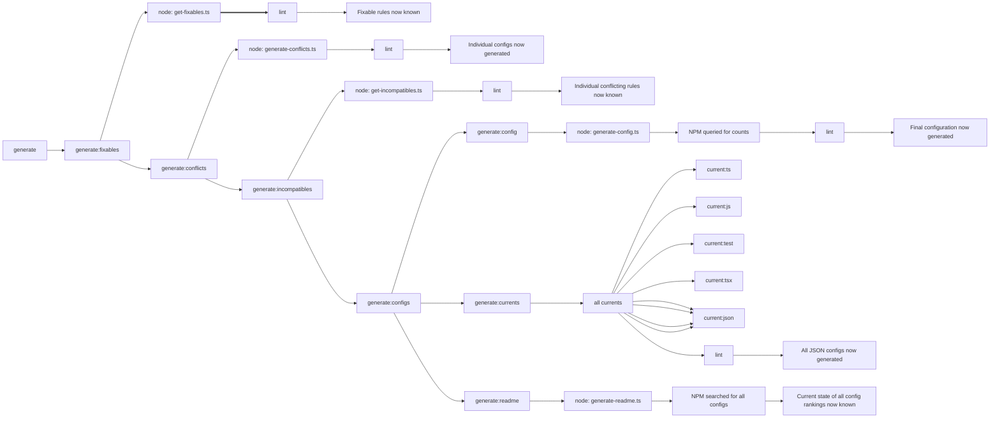

# Lint The Current Thing


An **extremely unopinionated** config based on an automatically generated popularity contest between the most downloaded ESLint configs/plugins/parsers/rules.

**_Now with automated conflict discovery and mitigation!_**

> _"Finally, a config everyone hates!"_

---

Linting is too opinionated. In fact, it can become political. `Eslint Config Current Thing` generates an ESLint config objectively based on whatever the current thing is at the time of build w/r/t broad ecosystem-wide definitions and opinion around JavaScript linting. Now, market competition can settle the debate.

Presently, lint the current thing combines these configs (and their plugins, submodules, etc.):

<!-- Start Generated List of Configs DO NOT EDIT! -->

|                                          |                             |                     |                             |
| ---------------------------------------- | --------------------------- | ------------------- | --------------------------- |
| AirBnb                                   | AirBnb Base                 | AirBnb-Typescript   | Ava                         |
| CSS Modules                              | Chai Friendly               | Comments            | Compat                      |
| Create React App                         | Cypress                     | ES-X                | ESLint                      |
| Emotion CSS                              | Functional                  | Google              | GraphQL                     |
| Import                                   | Internationalization (i18n) | JSDoc               | JSONC                       |
| JSX Accessibility (JSX A11y)             | Jasmine                     | Jest                | Jest Dom                    |
| Jest Formatting                          | MDX                         | Markdown            | Microsoft SDL               |
| Mocha                                    | NextJS                      | No Only Tests       | No Unsanitized              |
| No Unused Imports                        | No Use Extend Native        | Node.js             | Perfectionist               |
| Playwright                               | Prefer Arrow                | Prettier            | Prettier Plugin PackageJSON |
| Prettier Plugin Tailwind                 | Promises                    | React               | React Hooks                 |
| React Native (Independent Plugin/Config) | React Native Config         | React Native Plugin | React Performance           |
| React Prefer Function Component          | React Refresh               | Regular Expressions | RxJS                        |
| Security                                 | Shopify                     | Simple Import Sort  | SonarJS                     |
| Sort Class Members                       | Standard                    | Standard JSX        | Standard React              |
| Standard TS                              | Storybook                   | Stylistic           | TSDoc                       |
| Tailwind CSS                             | Testing Library             | TypeScript          | Typescript Sort Keys        |
| Unicorn                                  | XO                          | YML                 | You Don't Need Lodash       |

|

<!-- End Generated List of Configs DO NOT EDIT! -->

The winning (and thus most readily supported) high-level architecture is:

| Types        | FrontEnd                 | Testing | Style      |
| ------------ | ------------------------ | ------- | ---------- |
| `Typescript` | `React` / `React Native` | `Jest`  | `Prettier` |

## Technical explainer

This is a meta-config of many configs. Each config/plugin above is added to ESLint's flat config in the order of its NPM download popularity. After the rules of flat-configs are applied, each rule is turned on or off and set with the settings that are present in the config that is the most popular which has an opinion about that rule. Rule are applied only to their appropriate file types. The result is an objectively set config.

## Why?

Linting is usually very basic or incrementally added as teams have no reason or time to sit down like AirBnB or Vercel and justify and debate every last ESLint rule, but they do all sit down and figure something out. Internally, the linting is almost always sub-par, and externally, over time, hundreds of eslint plugins and configurations have emerged with various levels of popularity and maintenance, but they usually only address the small set of things that the team who developed them needed to address and invariably miss something. And the "something" that is missed, in aggregate, constitutes a Pareto Ratio of best practices; there is a linting rule for just about everything which is hated about JS, yet you'd never be able to find them all, or have the time to implement them. This is complicated by the fact that NPM does not make searching for ESLint configs/plugins easy. And just when the ecosystem begins to coalesces around some answers, the next new framework emerges, best practices get inverted, configs go out of maintenance, and rules become irrelevant/bad and everybody has to solve the same problems again (for instance, Prettier Plugins are now solving many of the same things the ESLint plugins have been solving for years but that no one spent the time to research). Lint The Current Thing essentially grabs as many configs, plugins, and opinions as possible, indiscriminately, provided they meet minimum thresholds of quality, and compares each rule on a popularity contest, so whatever Lint The Current Thing is (provided you update your packages) that will fundamentally be tied to ecosystem-wide best practices as supported by the most people. Lint The Current Thing achieves this via active package discovery, automated conflict resolution, and automated-reporting. As such, LTCT produces code that is accessible to the widest possible set of developers and stays in-step with the ecosystem. You can read more in the ["Why is this a good idea?"](#why-is-this-a-good-idea) section.

<!-- Start Generated Rule Counts DO NOT EDIT! -->

Unsurprisingly, it is incredibly strict with popularity-based opinions on:

- **1262** TSX rules
- **1254** Testing rules
- **1218** JSX rules
- **1118** Typescript rules
- **1074** Javascript rules
- **33** JSON rules
- **24** YML rules
- **5** MD rules

<!-- End Generated Rule Counts DO NOT EDIT! -->

Surprisingly, _it works_.

---

## Install

This config is premised on the [new ESLint Flat Config](https://eslint.org/blog/2022/08/new-config-system-part-1/), so it needs a `eslint.config.js`. Obviously, it requires `eslint` and `typescript` as well.

```bash
npm i -D eslint-config-current-thing
```

Then in your `eslint.config.js`

```js
import currentThing from "eslint-config-current-thing";

const config = [...currentThing()];

export default config;
```

You'll also probably want something like this in your `package.json` (edit accordingly):

```json
{
  "type": "module",
  "prettier": {},
  "remarkConfig": {
    "plugins": ["remark-preset-lint-recommended"]
  },
  "engines": {
    "node": ">=20.0.0"
  },
  "browserslist": [
    "defaults and supports es6-module",
    "maintained node versions"
  ]
}
```

And if you are using VS Code, you should get the extension for ESLint `dbaeumer.vscode-eslint` where you will need to add this to your `settings.json`:

```json
{
  "eslint.experimental.useFlatConfig": true
}
```

And you'll probably want to restart your ESLint server, maybe more than once. `Command Pallet` > `Restart ESLint Server`

Oh god, what have we done.

---

## Usage

```js
import currentThing from "eslint-config-current-thing";

const config = [
  // Rules here will be overridden by the current thing, if they collide
  ...currentThing(),
  // Rules here will override the current thing, if they collide
];

export default config;
```

### Options

Presently, there are three options: `disable`, `override`, and `threshold`.

For `disable` and `override` a few configs will have internal configs or overrides, for instance `shopify` has a config for `esnext`, `react`, and others. These can be targeted via adding a secondary namespace, ie, `@shopify/eslint-plugin/jest` (all lowercase, but look up in the source def for exact targets).

#### `disable`

To disable the entirety of a particular config, that config must be named via its package name, like so:

```js
import currentThing from "eslint-config-current-thing";

const config = [...currentThing({ disable: ["eslint-config-import"] })];

export default config;
```

E.g. if you disable every config, in order from the most downloaded down, until you hit `functional`, then functional will be your leading config and your project will then be linted with the recommended functional style.

**WARNING: `disable` may have unintended consequences where the linted code might get into an irreconcilable state, as various configs can toggle rules. We attempt to guard against this with automated conflict resolution but things can still sneak by.**

#### `override`

In the event that you need to override or change a rule in order with respect to all other rules:

```js
import currentThing from "eslint-config-current-thing";

const config = [
  ...currentThing({
    override: { "eslint-config-airbnb": { "no-restricted-syntax": 2 } },
  }),
];

export default config;
```

`override` will not clear existing rules but is provided in the unlikely case that a given rule needs more fine-tuning,

`disable` takes precedence over `override`.

#### `threshold`

`threshold` can be passed to the options object to set the popularity threshold for packages. Defaulting to 400,000 downloads per month.

```js
import currentThing from "eslint-config-current-thing";

const config = [
  ...currentThing({
    threshold: 1_000_000,
  }),
];

export default config;
```

This would only include packages that exceed 1,000,000 downloads per month, and thus would constitute a more lenient linting config as less rules will be activated.

### Observability

There are a crazy amount of rules in this config, and they are completely overwhelming. Try easing into them by setting a high `threshold`, and understanding what you are getting into:

- To see the current config standings, checkout [`src/config.js`](./src/config.js)
- To see the full current rule set, checkout:

  - TS [`current-ts.json`](./current-ts.json)
  - JS [`current-js.json`](./current-js.json)
  - Test [`current-test.json`](./current-test.json)
  - TSX [`current-tsx.json`](./current-tsx.json)
  - JSX [`current-jsx.json`](./current-jsx.json)
  - JSON [`current-json.json`](./current-json.json)

### Overwrite Preferences

What is more, you can Enable, Disable, Add or Alter any rule you come across, like so:

```js
import currentThing from "eslint-config-current-thing";

const config = [
  ...currentThing(),
  {
    // Enable/Disable/Alter any set of specific rules
    rules: {
      "functional/no-this-expressions": 2,
    },
  },
];

export default config;
```

---

## Config Methodology - "The Rules"

### 1. Additions

**For a CONFIG to be added, it needs to have around 400,000 monthly downloads (or 4 consecutive weeks above 100,000 weekly downloads).** This is to prevent spam, bloat, needless PRs, and arguments about minutia. But it's also variable as configs change popularity. Yes, it's arbitrary (and it can be spoofed/is [naively calculated](https://blog.npmjs.org/post/92574016600/numeric-precision-matters-how-npm-download-counts-work.html)), but it seems to be a good heuristic for the cutoff between generally used configs and niche configs.

**For a PLUGIN to be added, it needs to be included in an added config, or meet similar config quality standards.** This is to ensure that configs work as intended.

In short, it should be easy for a plugin to get added and stay added, but hard for a config.

To determine if your preferred config is eligible, visit the NPM page and check the weekly download count, or scroll to the bottom to see a list of packages presently under consideration.

You can always extend/disable this config to meet your own needs. However, if you think a config should be included, and it passes the `monthly count test` (and is not garbage/has stars/contributors, etc.), open a PR or Issue, and it will be added. When adding a rule, the "recommended" version of that rule will be unashamedly ~~smashed~~ used with as little alterations as possible.

Outside of getting the various pieces to play nice together, Lint the Current Thing does all it can to _not_ define any new individual rules or to have any opinion. See Conflicts below.

**\[Holding back intensifies]**

### 2. Conflicts

**Conflicting rules favor the preferences of more popular configs via the rules of ESLint flat-config merging.** Adding a bunch of configs will introduce conflicts. But conflicts are now automatically resolved on a config and rule basis, where conflicting rules are disabled (set to `0`) at the conflict config order. This way, they are ideologically in line with the popularity contest. If two conflicting configs switch order, the rules will switch as well. To see the full list of generated conflicts check out [incompatibilities](src/conflicts/incompatibilities.ts). If conflicts can not be resolved this way (i.e. three or more differently named rules which cyclically enforce opposing behavior) then the rules are manually added to the config as known conflicts. It would add insane complexity to fix this automatically to find the less than 5 cases where this actually happens.

### 3. Sub-Categories

**Whatever the leading config is, for any particular thing, that is the config which gets to decide other config's sub-preferences, winner take all, for that particular thing.** ESLint is about linting JavaScript, and many rules and opinions exist around what constitutes "appropriate" use of JS. Many of those opinions not only deal with JavaScript but also deal with auxiliary or tangential systems. Of those tangential systems, where there are conflicts which can not be resolved via merging, the popular winner takes all. For instance, despite being well-supported, very few people use Flow in comparison to TypeScript for typing. Thus, Typescript gets to dominate typing framework and other packages are expected to use their TypeScript-native rules, while Flow is discouraged / unsupported. If Flow suddenly became more popular than TypeScript, this would change. In most cases, opposing frameworks can both be included, like varying style guides (e.g. prettier vs standard vs functional) as neither present fundamentally breaking changes to the other.

### 4. Linting Lag

In the case of the linting ecosystem _strongly favoring against something_ but that thing being an integral part of new, cutting-edge development, new cutting-edge tech will take precedent by **disabling** rules which oppose it. For example, the [semi-recent linting sentiment](https://dev.to/jackshen/stop-using-for-loops-here-s-why-2hp) of "we will never use loops again" being encumbered by the usefulness (and perhaps [need](https://stackoverflow.com/questions/53798589/await-loop-vs-promise-all)) of `for await ... of` loops and AirBnB (a very popular config) still recommending against.

### 5. Abandoned Configs

Considering that linting is such a minor part of coding, often times popular configs will be abandoned and then forked, and the community will continue to use both config versions, and most will have no idea of the split. In such cases (e.g. Comments and Node) the two versions will be grouped together such that their download counts are combined and dependencies are flushed, but only the maintained rules will be added or supported.

If a repository is abandoned due to lack of community interest and has no fork--because no one wants/needs it. It will be removed.

---

## Why is this a bad idea?

1. "Everything popular is wrong" - Oscar Wilde
1. There is a KXCD for this:

   

1. Somebody will game the system to get a billion weekly downloads.
1. Because NPM naively calculates the download count, once a config makes it into the `current-thing` it will never and can never leave (Until we up the download count minimum or check in nodes modules, etc.)
1. We are moments away from AI linting code way better than ESLint. Mere moments!

## Why is this a good idea?

That said, there are some very compelling reasons to use this config above other configs:

1. Please watch "[**Code is for Humans**](https://frontendmasters.com/teachers/kyle-simpson/code-is-for-humans/)" by Kyle Simpson, author of "[You Don't know JS](https://github.com/getify/You-Dont-Know-JS)". Tying the way that code is written to the way that the most people read it helps ensure that it is accessible for the most humans. A project which adheres to whatever the `current thing` is can be objectively certain that the _most developers in the entire ecosystem_ will be somewhat comfortable approaching it. This makes debugging, contributing, using, understanding, and sharing code easier. No one will be 100% happy with the linting results (what else is new?), but this at least provides some basis to ease developer ramp up time with any particular project or JS code base. Linting React code as React Native code sounds dumb at first, but its really no different from using a superset of React, which is the exact same pattern as Typescript and JS, by putting tighter limits on the code, it makes it more accessible to a wide range of participants.

1. It adds a "higher-authority" or "single source of truth" to config discussions--which is not just someone else's opinion, but aggregate opinion at large, as it spreads across use cases. And as such, it better arbitrates disagreement. Many rules offer links to justification, and it's hard to argue that more learning about JS is bad.

1. Further, it encourages developers to stop making yet more highly opinionated individualized ESLint configs, and instead coalesce around the community configs they like. We love Prettier's stance embracing _opinionated_ configurations, but it does not do well as an example for the ecosystem--if everyone embraces being highly opinionated, everyone loses. If someone truly is willing to die on some linting hill, and wishes that everyone would conform to their demands, they should seek to add those rules to an existing config which this config extends, simply because this config exists, and someone else, somewhere, might also be already using it, and love the new idea. Sure, you could do that with any other config, but what other config is as encompassing and as unopinionated as this? If you go it alone, you may not have any allies, may never get the message out, or worse still, may never have the rude awakening that it's just not a good idea.

1. Custom or extremely granular rules which add value to qualifying configs and are not defined in higher-ranking configs still make it into the `current thing` final config, no matter how obscure. This alters strategies for convincing people about the merits of your new rule. It puts a bid on new rule creation in existing/popular repos, making existing rule sets more robust. In addition to stopping config proliferation, it actually helps build better rules. And more so, it encourages developers behind more popular configs to remain competitive.

1. This config will shift as the opinions in JS Linting shift, just as all human languages shift. All of those shifts in opinion, both outside and in the config will happen on the margin. Non-democratic configs do not listen to this nuance, they take a stance and see if anyone follows. To demonstrate how `current thing` manages this, clone this repo and open up `src/config.js`. Then, alter the `order` of the configs, and you will see how the rules _marginally_ change. It's not just that [software is eating the world](https://a16z.com/2011/08/20/why-software-is-eating-the-world/), it's actually _JavaScript_ software, and we must be cognizant of how everyone is using it in wildly disparate ways as new styles, processes, and technologies rise and old ones fall.

1. Unlike many other configs, this config completely abstracts away the need to add any other `eslint` packages, configs, plugins, and management. It is a pure barbell--absolutely simple in its application, and yet insanely complex and heavy-weight in its implementation.

1. This config can be, and should be, used as an auditing tool. It exposes an eye watering amount of linting problems. I'm not crying. You're crying.

## What is everyone saying?


---

## Great resources that this project draws heavily upon

- [Awesome ESLint](https://github.com/dustinspecker/awesome-eslint)
- [Sheriff ESLint Config](https://www.eslint-config-sheriff.dev/)
- [Eslint-Config-Hardcore](https://www.npmjs.com/package/eslint-config-hardcore)

## Architecture

We're expecting to see an Architecture section, huh?



## We will not be adding these configs

<!-- Start Generated Rejected Count DO NOT EDIT! -->

In an effort to find as many possible ESLint appropriate packages, plugins, and configs, we have cast a massive net to comb through NPM packages so you don't have to. The amount of acceptable packages is bottomless, but taken from the most downloaded package that meets our widest search terms ("config" "plugin" or "eslint") the count of rejected packages should be a heuristic for the depth at which the current package runner-up is at.

The amount of packages reviewed and rejected **538**.

<!-- End Generated Rejected Count DO NOT EDIT! -->

See [rejected](./src/packages/rejected.ts) for the full list with notes. But it's always open for debate!

## We are considering adding these configs

<!-- Start Generated Under Consideration List DO NOT EDIT! -->

The following section is generated according to spec.

Generated on 6/18/2024, total known packages **15,019**. Top 40 next in line, downloads for the previous 28 days:

- 3,362,769 downloads, [@trivago/prettier-plugin-sort-imports](https://www.npmjs.com/package/@trivago/prettier-plugin-sort-imports)
- 2,746,883 downloads, [eslint-plugin-turbo](https://www.npmjs.com/package/eslint-plugin-turbo)
- 2,693,610 downloads, [eslint-config-turbo](https://www.npmjs.com/package/eslint-config-turbo)
- 2,590,999 downloads, [prettier-plugin-organize-imports](https://www.npmjs.com/package/prettier-plugin-organize-imports)
- 1,982,716 downloads, [eslint-plugin-vitest](https://www.npmjs.com/package/eslint-plugin-vitest)
- 1,393,179 downloads, [@svgr/plugin-prettier](https://www.npmjs.com/package/@svgr/plugin-prettier)
- 1,284,569 downloads, [@ianvs/prettier-plugin-sort-imports](https://www.npmjs.com/package/@ianvs/prettier-plugin-sort-imports)
- 1,283,246 downloads, [eslint-plugin-ban](https://www.npmjs.com/package/eslint-plugin-ban)
- 1,209,751 downloads, [eslint-plugin-formatjs](https://www.npmjs.com/package/eslint-plugin-formatjs)
- 1,045,830 downloads, [@vercel/style-guide](https://www.npmjs.com/package/@vercel/style-guide)
- 967,582 downloads, [@prettier/plugin-xml](https://www.npmjs.com/package/@prettier/plugin-xml)
- 916,116 downloads, [toml-eslint-parser](https://www.npmjs.com/package/toml-eslint-parser)
- 754,479 downloads, [eslint-plugin-no-relative-import-paths](https://www.npmjs.com/package/eslint-plugin-no-relative-import-paths)
- 739,098 downloads, [@vercel/edge-config](https://www.npmjs.com/package/@vercel/edge-config)
- 728,155 downloads, [eslint-traverse](https://www.npmjs.com/package/eslint-traverse)
- 696,341 downloads, [eslint-plugin-wdio](https://www.npmjs.com/package/eslint-plugin-wdio)
- 581,558 downloads, [@prettier/plugin-ruby](https://www.npmjs.com/package/@prettier/plugin-ruby)
- 529,966 downloads, [eslint-plugin-qunit](https://www.npmjs.com/package/eslint-plugin-qunit)
- 509,649 downloads, [prettier-plugin-sh](https://www.npmjs.com/package/prettier-plugin-sh)
- 484,172 downloads, [eslint-plugin-import-x](https://www.npmjs.com/package/eslint-plugin-import-x)
- 455,109 downloads, [@wordpress/eslint-plugin](https://www.npmjs.com/package/@wordpress/eslint-plugin)
- 444,309 downloads, [volar-service-prettier](https://www.npmjs.com/package/volar-service-prettier)
- 436,134 downloads, [eslint-config-flat-gitignore](https://www.npmjs.com/package/eslint-config-flat-gitignore)
- 434,990 downloads, [prettier-plugin-astro](https://www.npmjs.com/package/prettier-plugin-astro)
- 412,312 downloads, [eslint-plugin-github](https://www.npmjs.com/package/eslint-plugin-github)
- 411,959 downloads, [prettier-plugin-java](https://www.npmjs.com/package/prettier-plugin-java)
- 410,707 downloads, [eslint-plugin-import-helpers](https://www.npmjs.com/package/eslint-plugin-import-helpers)
- 407,868 downloads, [eslint-plugin-antfu](https://www.npmjs.com/package/eslint-plugin-antfu)
- 400,676 downloads, [eslint-config-semistandard](https://www.npmjs.com/package/eslint-config-semistandard)
- 398,253 downloads, [eslint-plugin-react-compiler](https://www.npmjs.com/package/eslint-plugin-react-compiler) - Not Yet Eligible
- 395,258 downloads, [eslint-plugin-i18n-text](https://www.npmjs.com/package/eslint-plugin-i18n-text) - Not Yet Eligible
- 394,720 downloads, [@lwc/eslint-plugin-lwc](https://www.npmjs.com/package/@lwc/eslint-plugin-lwc) - Not Yet Eligible
- 394,634 downloads, [eslint-plugin-fp](https://www.npmjs.com/package/eslint-plugin-fp) - Not Yet Eligible
- 384,714 downloads, [wp-prettier](https://www.npmjs.com/package/wp-prettier) - Not Yet Eligible
- 375,915 downloads, [@juigorg/sit-nam-neque](https://www.npmjs.com/package/@juigorg/sit-nam-neque) - Not Yet Eligible
- 374,286 downloads, [eslint-plugin-testcafe](https://www.npmjs.com/package/eslint-plugin-testcafe) - Not Yet Eligible
- 370,916 downloads, [@wordpress/prettier-config](https://www.npmjs.com/package/@wordpress/prettier-config) - Not Yet Eligible
- 366,342 downloads, [@sap/eslint-plugin-cds](https://www.npmjs.com/package/@sap/eslint-plugin-cds) - Not Yet Eligible
- 364,299 downloads, [eslint-config-xo-typescript](https://www.npmjs.com/package/eslint-config-xo-typescript) - Not Yet Eligible
- 364,271 downloads, [prettier-plugin-sort-json](https://www.npmjs.com/package/prettier-plugin-sort-json) - Not Yet Eligible

<!-- End Generated Under Consideration List DO NOT EDIT! -->
